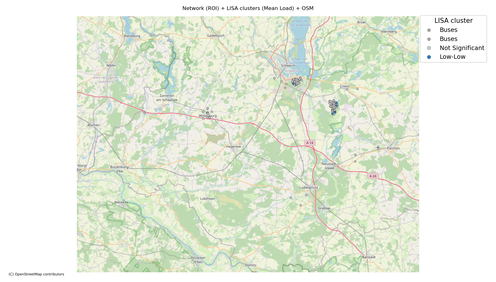

# geoloadst
**Spatial and spatio-temporal load instability analysis for distribution networks**

`geoloadst` is a Python package for analyzing **spatial** and **spatio-temporal** load-instability patterns in power distribution networks (with first-class support for **SimBench/pandapower**). It provides an end-to-end workflow centered on a high-level `InstabilityAnalyzer` API, plus modular core functions and visualization helpers.

It supports:
- **Spatio-temporal variogram analysis (STV)** — quantify spatial and temporal correlation structures in load anomalies
- **Directional anisotropy diagnostics** — directional variograms + polar range plots (global) and ellipse overlays (global/local)
- **Multi-dimensional instability features** — extract RMS, rate-of-change, oscillation metrics with PCA & clustering
- **Moran’s I spatial autocorrelation** — Global and Local Moran (LISA) for hotspot / outlier detection
- **Topology-aware analysis** — relate instability to network structure (e.g., degree / betweenness)
- **Scenario utilities** — operate on load profiles (e.g., industrial day/night patterns) and compare signatures

---

## Installation

```bash
# Clone the repository
git clone https://github.com/GeoLoadSTLab/geoloadst.git geoloadst-repo
cd geoloadst-repo

# Install in development mode
pip install -e .

# Or install with dev dependencies
pip install -e ".[dev]"
```

### Dependencies

**Core (required):**
- `numpy`, `pandas`, `matplotlib`, `scipy`
- `scikit-learn` - PCA, KMeans, preprocessing
- `pandapower`, `simbench` - Power network modeling
- `scikit-gstat` - Geostatistical variogram analysis
- `libpysal`, `esda` - Spatial statistics (Moran's I)
- `networkx` - Graph/topology analysis

**Visualization (optional):**
- `geopandas`, `shapely` - Geospatial data handling (install with `pip install geoloadst[viz]`)
- `contextily` - OpenStreetMap basemaps (optional, for map backgrounds)

> **Note**: OSM basemaps require `contextily`. Install with: `pip install contextily>=1.3`

## Quick Start

The examples below default to small ROI/time windows and bounded pairs to stay memory-friendly.

### Example 1 — Small ROI Moran + LISA map (plots)

```python
import matplotlib.pyplot as plt
import simbench
from geoloadst import InstabilityAnalyzer
from geoloadst.viz.maps import plot_lisa_clusters_map

net = simbench.get_simbench_net("1-complete_data-mixed-all-1-sw")
analyzer = InstabilityAnalyzer(net, roi=(10.8, 11.7, 53.1, 53.6), time_window=(0, 48), dt_minutes=15.0)
analyzer.prepare_data()
print(f"Buses selected in ROI: {len(analyzer.bus_ids)}")
analyzer.compute_spatiotemporal_instability(max_buses=200, max_times=48, max_pairs=50_000)
moran = analyzer.compute_moran_analysis(k_neighbors=8, permutations=99)

fig, ax = plot_lisa_clusters_map(
    analyzer.bus_ids,
    analyzer.coords,
    moran["clusters_mean_load"],
    net=net,
    title="LISA clusters (mean load)",
)
plt.show()
```

### Example 2 — Instability overlay with critical buses (plots)

```python
import matplotlib.pyplot as plt
import simbench
from geoloadst import InstabilityAnalyzer
from geoloadst.viz.maps import plot_instability_overlay

net = simbench.get_simbench_net("1-complete_data-mixed-all-1-sw")
analyzer = InstabilityAnalyzer(net, roi=(10.8, 11.7, 53.1, 53.6), time_window=(0, 48), dt_minutes=15.0)
analyzer.prepare_data()
stv = analyzer.compute_spatiotemporal_instability(max_buses=200, max_times=48, max_pairs=50_000)

fig, ax = plot_instability_overlay(
    stv["bus_ids_used"],
    stv["coords_used"],
    stv["instability_index"],
    stv["critical_mask"],
    net=net,
    title="Critical buses (small ROI)",
)
plt.show()
```

### Example 3 — Quick summary (minimal/no plotting)

```python
import simbench
from geoloadst import InstabilityAnalyzer

# 1) Load network
net = simbench.get_simbench_net("1-complete_data-mixed-all-1-sw")

# 2) Small ROI + short time window (low RAM)
analyzer = InstabilityAnalyzer(
    net,
    roi=(10.8, 11.7, 53.1, 53.6),
    time_window=(0, 48),
    dt_minutes=15.0,
)
analyzer.prepare_data()

# 3) Resource-safe instability
analyzer.compute_spatiotemporal_instability(
    max_buses=150,
    max_times=48,
    max_pairs=50_000,
)

# 4) Moran/LISA 
moran = analyzer.compute_moran_analysis(k_neighbors=8)

# Print summary
print(f"Global Moran's I (mean load): {moran['moran_mean_load'].I:.4f}")
print(f"Top critical buses: {analyzer._stv_results['critical_bus_ids'][:5]}")
```

### Example 4 — Network + OSM basemap (requires contextily)

> **Note**: This example requires optional dependencies: `pip install geopandas shapely contextily`

```python
import simbench
import matplotlib.pyplot as plt
import geopandas as gpd
from shapely.geometry import Point
import contextily as ctx

from geoloadst import InstabilityAnalyzer
from geoloadst.viz.maps import plot_network_topology, plot_lisa_clusters_map
from geoloadst.viz.plots import plot_instability_histogram

# 1) Load network
net = simbench.get_simbench_net("1-complete_data-mixed-all-1-sw")

# 2) Small ROI + short time window (low RAM)
analyzer = InstabilityAnalyzer(net,roi=(10.8, 11.7, 53.1, 53.6),time_window=(0, 96),dt_minutes=15.0,)
analyzer.prepare_data()

# 3) Resource-safe instability
analyzer.compute_spatiotemporal_instability(
        max_buses=200,
        max_times=48,
        max_pairs=50_000,
)

# 4) Moran/LISA 
moran = analyzer.compute_moran_analysis(k_neighbors=8)

# Plot 1: Instability histogram
plot_instability_histogram(analyzer.instability_index,quantile=0.9,title="Instability distribution (ROI buses)",)
plt.show()

# Plot 2: Network + Basemap + LISA overlay
gdf = gpd.GeoDataFrame(
    {"bus_id": analyzer.bus_ids},
    geometry=[Point(xy) for xy in analyzer.coords],
    crs="EPSG:4326",
)

gdf_3857 = gdf.to_crs(epsg=3857)

coords_3857 = (
    gdf_3857.geometry.x.to_numpy(),
    gdf_3857.geometry.y.to_numpy(),
)
coords_3857 = list(zip(coords_3857[0], coords_3857[1]))  
import numpy as np
coords_3857 = np.asarray(coords_3857)

fig, ax = plt.subplots(figsize=(12, 8))

# 1) Basemap
xmin, ymin, xmax, ymax = gdf_3857.total_bounds
padx = (xmax - xmin) * 0.05
pady = (ymax - ymin) * 0.05
ax.set_xlim(xmin - padx, xmax + padx)
ax.set_ylim(ymin - pady, ymax + pady)

ctx.add_basemap(
    ax,
    source=ctx.providers.OpenStreetMap.Mapnik,
    zoom="auto",
)

# 2)  (Topology)  basemap
plot_network_topology(net=net,bus_ids=analyzer.bus_ids,coords=coords_3857,ax=ax,title="Network (ROI) + LISA clusters (Mean Load) + OSM",)

# 3) LISA clusters overlay 
plot_lisa_clusters_map(analyzer.bus_ids,coords_3857,moran["clusters_mean_load"],net=None,ax=ax,title=None,show_lines=False,)

# 4) Legend 
handles, labels = ax.get_legend_handles_labels()
if handles:
    ax.legend(handles, labels, title="LISA cluster",fontsize=14,title_fontsize=15,markerscale=1.8,framealpha=1,loc="upper right",)

ax.set_axis_off()
plt.tight_layout()
plt.show()

```

- Result:


## Memory Notes / RAM Warning


- Spatio-temporal variograms and pairwise distance computations can be heavy.
- On laptops or limited RAM, shrink the spatial ROI (roi=(xmin, xmax, ymin, ymax)) and shorten the time window (time_window=(start, end)).
- Use the STV knobs: max_buses, max_times, and max_pairs to bound work. Lower them if you still hit memory pressure.
- When you set max_buses, the analyzer replaces bus_ids/coords/bus_load_df with the subsampled active subset (full ROI copies stay in _bus_ids_full/_coords_full/_bus_load_df_full). Run Moran/LISA/plots with analyzer.bus_ids and analyzer.coords to avoid dimension mismatches.

## Troubleshooting

- Symptom: `geoloadst.__file__` is `None` and `geoloadst.__path__` shows `_NamespacePath(...)`. This usually means Python is picking up a folder that shadows the installed package (e.g., running Python from a parent directory named `geoloadst`).
- Fix:
  1) From the repo root (the one with `pyproject.toml`), run:
     ```bash
     python -m pip uninstall -y geoloadst
     python -m pip install -e .
     ```
  2) Confirm install:
     ```bash
     python -c "import geoloadst; print(geoloadst.__file__)"`
     ```
  3) Restart the Jupyter kernel so it picks up the edited install.
- Always import via the public API:
  ```python
  from geoloadst import InstabilityAnalyzer
  ```

## Package Structure

```
geoloadst/
├── __init__.py
├── api.py                    # High-level InstabilityAnalyzer class
├── io/
│   ├── __init__.py
│   └── simbench_adapter.py   # Network loading, coordinate extraction, load profiles
├── core/
│   ├── __init__.py
│   ├── preprocessing.py      # Detrending and standardization
│   ├── instability_index.py  # RMS instability, critical node classification
│   ├── spatiotemporal.py     # Space-time variogram analysis
│   ├── multidim_instability.py # Feature extraction, PCA, clustering
│   ├── moran.py              # Moran's I (global and local)
│   ├── topology.py           # NetworkX graph metrics
│   ├── resilience.py         # Resilience/scenario comparison utilities
│   └── roi.py                # ROI utilities / subnet extraction helpers
├── viz/
│   ├── __init__.py
│   ├── plots.py              # Histograms, variograms, directional/polar plots, PCA plots
│   └── maps.py               # Network/topology maps, GeoPandas overlays
├── scenarios/
│   ├── __init__.py
│   └── industrial_daynight.py # Industrial load pattern scenario
└── examples/
    └── example_simbench_basic.py
```

## Core Modules

### `geoloadst.io.simbench_adapter`

Functions for loading SimBench networks and extracting data:

```python
from geoloadst.io import load_simbench_network, extract_bus_coordinates, build_bus_load_timeseries

net = load_simbench_network("1-complete_data-mixed-all-1-sw")
bus_ids, coords, bus_to_coord = extract_bus_coordinates(net)
bus_load_df = build_bus_load_timeseries(net, bus_ids, max_times=96)
```

### `geoloadst.core.preprocessing`

Detrending and standardization:

```python
from geoloadst.core import detrend_and_standardize

values_std = detrend_and_standardize(bus_load_df, coords, dt_minutes=15.0)
# Returns (N, T) array with temporal and spatial trends removed
```

### `geoloadst.core.spatiotemporal`

Space-time variogram analysis:

```python
from geoloadst.core import compute_stv, compute_directional_variograms

stv_results = compute_stv(coords, values_std, dt_minutes=15.0)
dir_results = compute_directional_variograms(coords, instability_index)
```

### `geoloadst.core.moran`

Moran's I spatial autocorrelation:

```python
from geoloadst.core import build_knn_weights, global_moran, local_moran_clusters

W = build_knn_weights(coords, k=8)
moran = global_moran(mean_load, W)
clusters = local_moran_clusters(mean_load, W, alpha=0.05)
# clusters: 0=NS, 1=HH, 2=LL, 3=LH, 4=HL
```

### `geoloadst.scenarios.industrial_daynight`

Industrial day/night scenario:

```python
from geoloadst.scenarios import apply_industrial_daynight_pattern

results = apply_industrial_daynight_pattern(
    bus_load_df, coords,
    dt_minutes=15.0,
    day_factor=3.0,
    night_factor=0.3,
)
```

## Visualization
High-level plotting helpers live in geoloadst.viz.plots and geoloadst.viz.maps.

```python
from geoloadst.viz.plots import (
    plot_instability_histogram,
    plot_st_marginals,
    plot_directional_variograms,
    plot_directional_ranges_polar,
)

from geoloadst.viz.maps import (
    plot_network_topology,
    plot_topology_with_critical_buses,
    plot_instability_overlay,
    plot_lisa_clusters_map,
    plot_geopandas_map,
    plot_sample_critical_with_global_ellipse,
    plot_local_anisotropic_ellipses,
)


# Plot instability distribution
plot_instability_histogram(instability_index, quantile=0.9)

# Plot variogram results
plot_variogram_marginals(stv_results['stv'])

# Plot directional ranges (polar diagram)
dir_results = analyzer.compute_directional_variograms(angles_deg=(0, 45, 90, 135))
plot_directional_ranges_polar(dir_results, title="Directional Ranges")

# Plot network topology with critical buses (using analyzer)
plot_topology_with_critical_buses(analyzer=analyzer, title="Critical Buses")

# Plot LISA clusters on map
plot_lisa_clusters_map(bus_ids, coords, cluster_codes, net=net)
```

## License

MIT License - see LICENSE file for details.

## Citation

If you use this package in your research, please cite:

```bibtex
@software{geoloadst,
  title = {geoloadst: Spatial and spatio-temporal load instability analysis},
  year = {2024},
  url = {https://github.com/yourusername/geoloadst}
}
```

